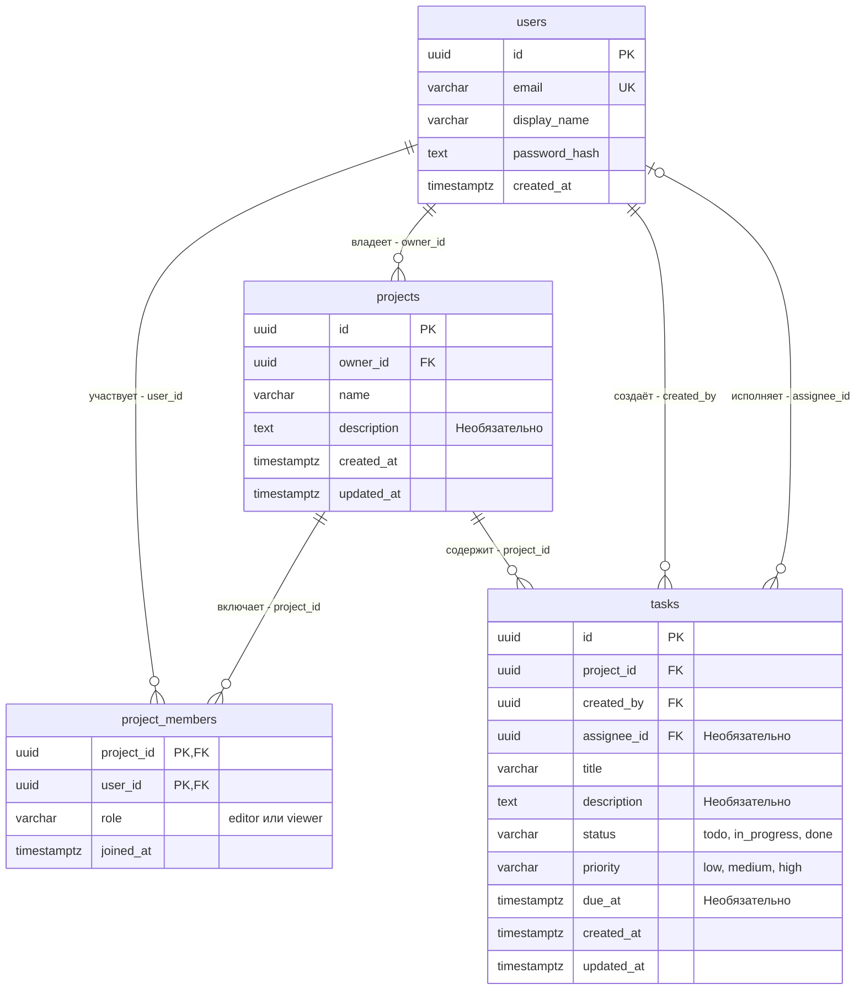

```mermaid
erDiagram
    users {
        uuid id PK
        varchar email UK
        varchar display_name
        text password_hash
        timestamptz created_at
    }

    projects {
        uuid id PK
        uuid owner_id FK
        varchar name
        text description "Необязательно"
        timestamptz created_at
        timestamptz updated_at
    }

    project_members {
        uuid project_id PK, FK
        uuid user_id PK, FK
        varchar role "editor или viewer"
        timestamptz joined_at
    }

    tasks {
        uuid id PK
        uuid project_id FK
        uuid created_by FK
        uuid assignee_id FK "Необязательно"
        varchar title
        text description "Необязательно"
        varchar status "todo, in_progress, done"
        varchar priority "low, medium, high"
        timestamptz due_at "Необязательно"
        timestamptz created_at
        timestamptz updated_at
    }

    users ||--o{ projects : "владеет - owner_id"
    users ||--o{ project_members : "участвует - user_id"
    projects ||--o{ project_members : "включает - project_id"
    projects ||--o{ tasks : "содержит - project_id"
    users ||--o{ tasks : "создаёт - created_by"
    users o|--o{ tasks : "исполняет - assignee_id"
```